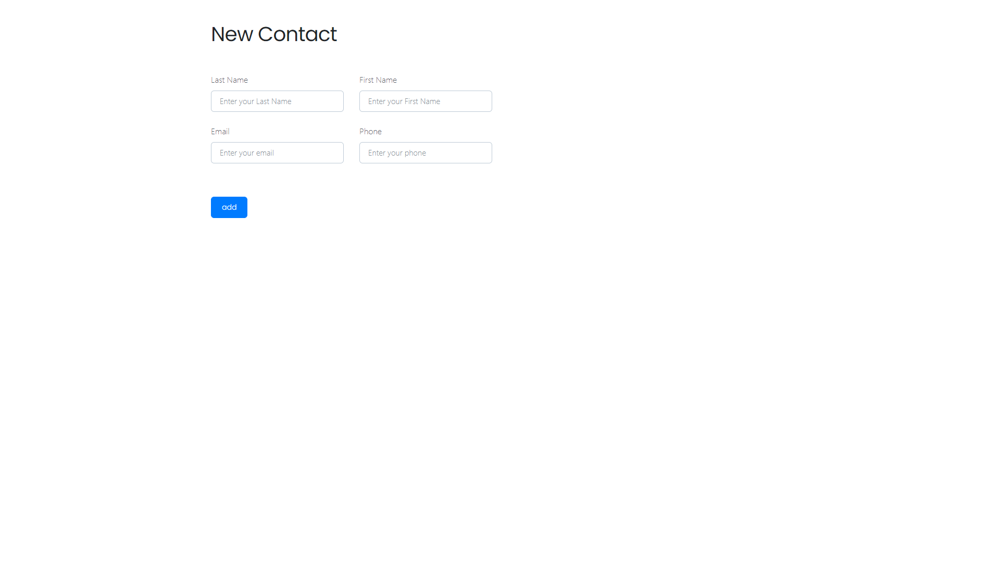
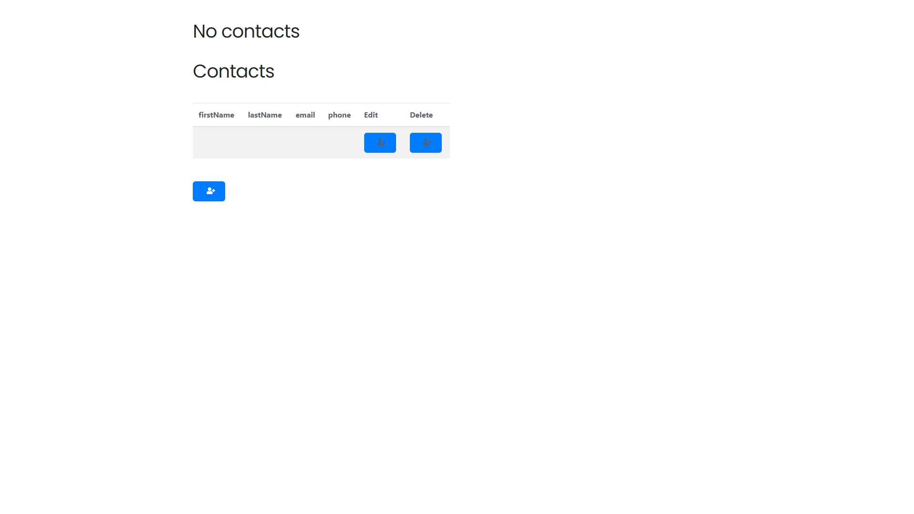
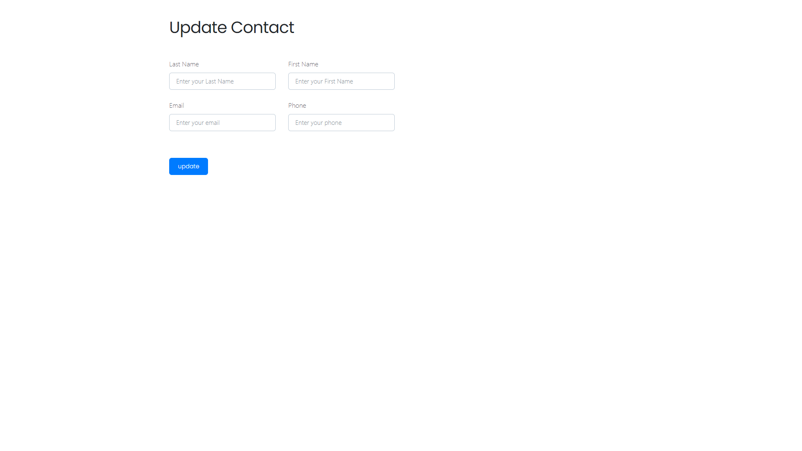

<H2>Contact List</H2>

<H3>Реализация приложение «Список контактов»</H3>

Небольшое консольное приложение «Список контактов». 
Интерфейс приложения реализован с помощью Thymeleaf,
обработка запросов происходит через контроллеры Spring MVC.
Сущность «Контакт» представляет из себя идентификатор (id),
имя (firstName), фамилию (lastName), почту (email) и телефон (phone).

<h3>Приложение имеет возможность:</h3>

* Выводить все контакты в таблице. Выводиться должны все поля сущности. 
* Добавлять новый контакт через форму. ID не должен добавляться через UI.
* Редактировать существующие контакты через форму. ID не должен меняться.
* Удалять конкретный контакт через кнопку в списке контактов.

<h3>Работа приложения:</h3>

1. Доступно два профиля работы приложения:

- dev(developer) Для разработки и работы без БД.(Стоит по умолчанию)
- prod(production) Работа с БД.

2. Для старта приложения необходимо в терминале выполнить следующие команды:

- "cd docker"
- "docker compose up"
- После успешнго завершения сборки контейнера можно запустить приложение.
- Приложение будет доступно по адресу http://localhost:8080/index
  
  
  
